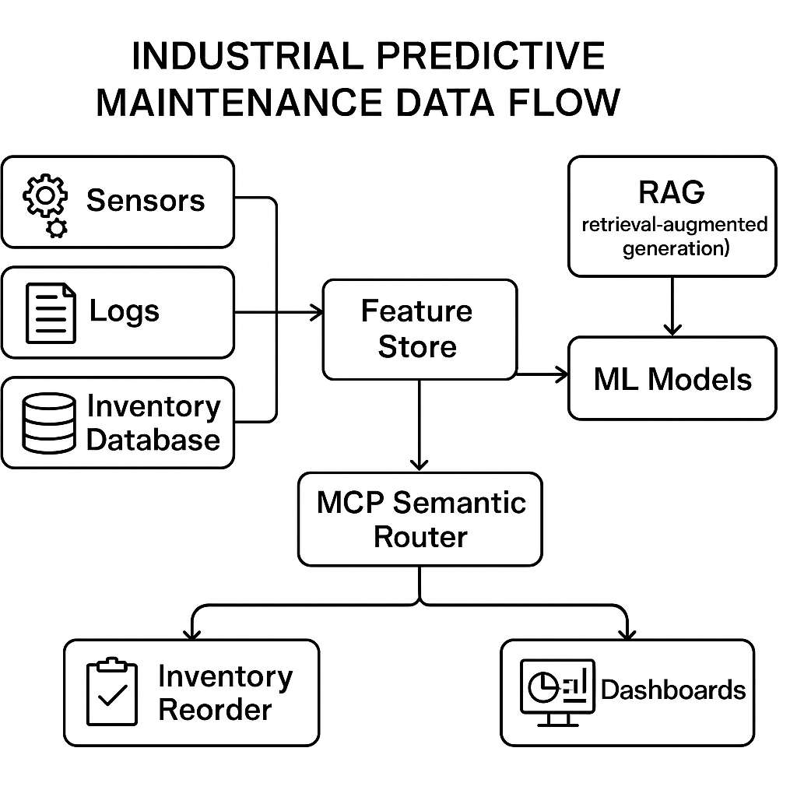

# HLD for Predictive Maintenance Solution
## Codvo's Core Role and Value Proposition
Codvo's value is not just in building AI models but in engineering a cohesive, end-to-end system that integrates probabilistic predictions with FabriCo's deterministic business operations. We act as the AI systems integrator, transforming raw data into automated actions and measurable business outcomes like reduced downtime and optimized inventory.
### Bespoke Engineering Efforts

#### Model Context Protocols (MCPs)
Designing and implementing the custom MCP schemas that serve as the nervous system of the solution, ensuring seamless communication between the AI models and FabriCo's existing systems.

#### Custom AI/ML Logic
Fine-tuning predictive models on FabriCo’s specific sensor data and maintenance history to create highly accurate, domain-specific failure predictors. This includes developing the core business logic for the Decision Engine that translates predictions into actions.

#### Systems Integration
Engineering the specific API connections and data transformations required to interface with FabriCo's proprietary inventory management database and other internal systems.

### Leveraging Existing Tools

#### Data Ingestion & Processing
We will use robust open-source or commercial tools for initial data handling. This includes <b>OCR engines</b> (e.g., <i>AWS Textract</i>) for digitizing paper records and <b>ETL/ELT frameworks</b>.

#### Infrastructure
We'll build upon standard cloud infrastructure (e.g., AWS, GCP, Azure) and leverage managed services for databases, data lakes, and compute.

#### AI Components
We will use foundational open-source components like <b>vector databases</b> (e.g., <i>Pinecone, ChromaDB</i>) for RAG and established workflow orchestration tools (e.g., Prefect, Temporal) to manage the process flow.


## High-Level Data Flow and Solution Components
The solution is designed as a modular, event-driven architecture that moves data from ingestion to actionable insight.

### End-to-End Data Flow

1. <b>Ingestion</b>: Unstructured maintenance records are processed by an <b>OCR pipeline</b>, and the extracted text is chunked, embedded, and stored in a <b>vector database</b>. Real-time structured sensor data streams into a time-series database. Inventory data is accessed via a secure API.
2. <b>Prediction</b>: A <b>predictive maintenance model</b> continuously analyzes incoming sensor data to calculate failure probabilities for specific equipment and components.
3. <b>Enrichment & Action</b>: When a prediction exceeds a confidence threshold, it generates an event. This event triggers the system to fetch relevant historical context from the vector database using <b>RAG</b>.
4. <b>Decision & Orchestration</b>: The prediction and its enriched context are packaged into a <b>Model Context Protocol (MCP)</b>. This structured MCP is sent to a Decision Engine, which initiates a workflow: creating a maintenance ticket, alerting staff, and—if necessary—triggering a part reorder request.
5. <b>Output</b>: Actionable insights are delivered to maintenance teams via dashboards and alerts. Reorder requests are routed for <b>Human-in-the-Loop (HITL)</b> approval before being sent to the inventory system.

### Model Context Protocols (MCPs)
The MCP is the core of the integration layer. It's a rigidly defined, structured data contract (e.g., a JSON schema) that decouples the probabilistic AI from deterministic systems. For example, a failure prediction doesn't just output a "95% confidence." It generates an MCP:

```JSON
{
  "event_id": "evt-20250729-98a1",
  "machine_id": "M-7891",
  "component": "main_spindle_bearing",
  "predicted_failure": {
    "type": "overheating_seizure",
    "confidence": 0.95,
    "predicted_at": "2025-07-29T06:00:00Z",
    "time_to_failure_hours": 48
  },
  "required_parts": [
    {"sku": "FBC-PART-4567", "quantity": 2}
  ]
}
```
This MCP acts as a <b>semantic routing</b> key. The system reads this "verb" (`predicted_failure`) and "noun" (`machine_id, required_parts`) to route it to the correct downstream services: the ticketing system, the inventory API, and the maintenance team's dashboard.

### Retrieval Augmented Generation (RAG)
RAG is crucial for leveraging FabriCo's unstructured maintenance logs. We'll use it to provide context for failure alerts. When a failure is predicted, the system uses keywords from the <b>MCP</b> (e.g., <i>machine ID, failure type</i>) to query the vector database and retrieve summaries of similar past repairs.

#### Chunking Strategy
A hybrid approach will be used. Prose sections will be chunked <b>semantically</b> to preserve meaning, while tabular data within reports will be chunked row-by-row or by section.

#### Metadata Tagging
Each chunk will be tagged with critical metadata (`machine_id`, `factory_location`, `date_of_service`, `technician_id`), allowing for highly filtered and context-aware retrievals.

### Query Planning
For complex user queries like, "Find all instances of hydraulic pump failures in our CNC machines in Factory B that led to downtime greater than 12 hours," a Query Planner agent will decompose the query. It will first hit the vector DB to find documents about "hydraulic pump failures" with metadata filters for `type:CNC` and `location:FactoryB`, then cross-reference those results with structured downtime data from another database to satisfy the full request.

### Security, Governance, and Observability
These are designed-in, not bolted-on.

#### Security
Access to sensitive data and actions is managed via fine-grained access control.

#### Governance
We will use <b>Open Policy Agent (OPA)</b> to enforce business rules declaratively. 

For example, an OPA policy could state: `ALLOW reorder IF part_cost < $1000 OR user_role == 'manager'`. This makes rules auditable and easy to change without touching application code.

#### Observability
We will use <b>OpenTelemetry</b> to generate traces, logs, and metrics across the entire system. This allows us to trace a single prediction from the model all the way to the final ticket or reorder, which is critical for debugging and building trust.

### Workflow Orchestration and HITL
We recommend using a modern workflow orchestrator like Prefect or Temporal. These tools are excellent for managing complex, long-running processes that mix automated and human steps.

#### Human-in-the-Loop (HITL)
Critical decision points, such as approving a spare part order above a certain cost threshold or validating a low-confidence but high-impact failure prediction, will be explicitly designed as HITL tasks in the workflow. The system will assign the task to a human, wait for approval, and then resume the automated process.

## AI-First User Acceptance Testing (UAT) Strategy
UAT for an AI system must focus on building trust and validating performance against business goals, not just checking for bugs.

### Designing the UAT for Trust:

#### Shadow Mode Deployment
Initially, the system will run in `shadow mode`. It will make predictions and generate reorder suggestions but will not execute them. These outputs will be logged and presented to the maintenance team on a dashboard.

#### Comparative Analysis
FabriCo's expert technicians will review the AI's recommendations against their own decisions and actual outcomes. 

The goal is to measure the AI's:
1. precision (are its predictions correct?)
2. Recall (does it catch failures that humans miss?)

#### Gradual Automation
As trust is established and model performance is validated, automation will be phased in. We'll start by automating low-risk, high-confidence actions (e.g., reordering low-cost parts) before moving to more critical automation.

### Critical Data-Centric Validation Steps:

#### Ingestion Fidelity
We will perform sampling to compare the OCR-scanned text against the original documents to ensure a high degree of accuracy. Errors here would poison the entire RAG system.

#### Ontology Alignment
This is paramount. We will conduct a dedicated validation phase to ensure the entities recognized by the AI (e.g., `part_sku_123`, `machine_model_ABC`) perfectly match the ground truth in FabriCo's inventory and asset management systems. A mismatch here could lead to ordering the wrong parts.

#### Feature and Aggregation Logic
UAT will involve reviewing the data pipelines that feed the predictive models. We will validate that data aggregations (e.g., `average_vibration_over_1hr`, `max_temperature_in_24hrs`) are calculated correctly and align with the expectations of FabriCo's maintenance experts.

## Our Use of AI in Solutioning (Context Engineering)
As a Solution Architect, I use a process called Context Engineering to leverage LLMs internally to build better, faster solutions for our clients.

### Accelerating Solution Design with LLMs
My process isn't to ask an LLM to `solve the problem`. Instead, I use it as a cognitive partner through a structured, iterative process:

#### Seed with a Meta-Prompt
I begin by feeding an LLM a comprehensive `meta-prompt` that includes the client's problem statement (the scenario provided), Codvo's core principles (NeIO, MCPs), and the required output format (the structure of this document).

#### Structured Deconstruction
I then use the LLM to brainstorm and outline the key components of the solution (e.g., `List potential data sources and the corresponding ingestion strategies`, `Propose three different ways to implement a human-in-the-loop workflow`).

#### Iterative Refinement and Tooling Analysis
I refine each section with more targeted prompts, such as comparing specific technologies (`Compare and contrast Prefect and Airflow for a use case involving event-driven, HITL workflows`). This output is critically reviewed and edited by me to ensure it aligns with our engineering best practices.

#### Shared Context Repository
All prompts, LLM responses, and my refined architectural diagrams and notes are stored in a shared repository (e.g., a Git-based wiki). This repository becomes the living "context" for the project.

### Ensuring the Plan is Actionable
This approach ensures the final plan is actionable and guides the development team effectively by:

#### Defining a Ubiquitous Language
Key concepts like "MCP" are clearly defined with examples, so everyone from architects to junior developers shares the same understanding.

#### Providing a "Rationale Trail"
The repository shows why decisions were made (e.g., the comparison of workflow tools), which helps the team understand the trade-offs.

#### Creating Starter Artifacts
The process generates concrete starting points, like the example MCP JSON schema. This allows an engineering pod to immediately begin building a proof-of-concept based on a well-defined contract, rather than starting from a vague conceptual brief.


------------
--------
--------
----------


# Prompts Used for Solution Generation
Below are examples of the prompts that would be used in the Context Engineering process to generate the above solution design.

## Meta-Prompt to Seed the Initial Structure
```
Act as a Senior Solution Architect for an AI systems integration company called "Codvo." Your internal framework is called "NeIO" and it prioritizes structured integration via "Model Context Protocols" (MCPs), leveraging RAG for unstructured data, and a strong focus on governance (OPA) and observability (OpenTelemetry).

A new prospective client, "FabriCo," a large manufacturing company, needs a predictive maintenance solution.

Client's Data:
- Unstructured historical maintenance records (PDFs, scans).
- Structured real-time sensor data (vibration, temp, pressure).
- Relational database for their inventory management system.

Client's Goals:
1. Predict equipment failures.
2. Automate spare part reordering based on predictions and inventory.
3. Provide actionable insights to maintenance teams.

Your Task:
Generate a high-level solutioning approach for FabriCo. Structure the response into four main sections:
1.  **Codvo's Core Role and Value Proposition:** Explain our value and differentiate between our bespoke work vs. using commodity tools.
2.  **High-Level Data Flow and Solution Components:** Detail the end-to-end flow. Specifically explain the role of MCPs, RAG (mentioning chunking/metadata), Query Planning, Security (OPA)/Observability (OTel), and a Workflow Orchestration tool with HITL.
3.  **AI-First UAT Strategy:** Describe how to design UAT for a probabilistic system to build trust and what data-centric validation steps are critical.
4.  **Your Use of AI in Solutioning (Context Engineering):** Briefly explain how you use LLMs and a shared context repository to create and refine this plan, ensuring it's actionable for the development team.

Format the entire response using clear markdown headings, bold key terms, and be concise yet comprehensive.
```

## Targeted Prompt for Technology Comparison
```
For the FabriCo predictive maintenance solution, we need a workflow orchestration tool. The key requirements are:
- Ability to handle event-driven workflows triggered by an API call.
- Native support for long-running workflows that may wait for Human-in-the-Loop (HITL) approval.
- High fault tolerance and observability.
- A strong Python SDK.

Compare and contrast Temporal, Prefect, and Apache Airflow based on these requirements. Provide a concise recommendation with a brief justification.
```

## Targeted Prompt for UAT Strategy Detail
```
Elaborate on the "AI-First User Acceptance Testing (UAT)" section for the FabriCo predictive maintenance project. Focus on practical, data-centric validation steps. Describe how to build trust with the client's non-technical stakeholders. Specifically, detail the concepts of "shadow mode deployment" and the importance of validating "ontology alignment" between the AI's outputs and FabriCo's internal systems.
```