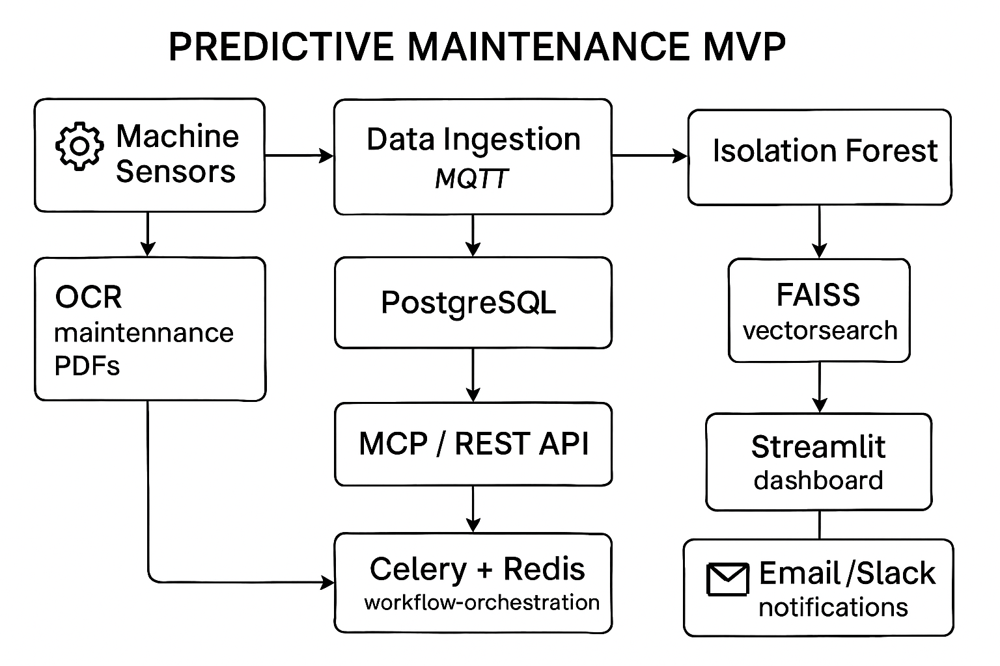
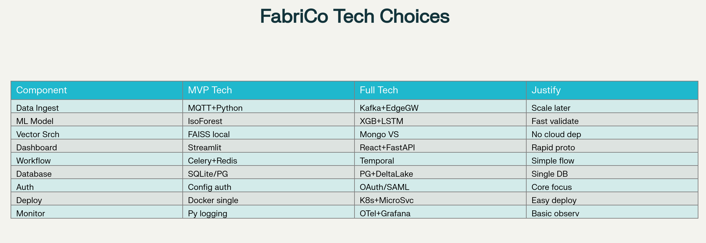
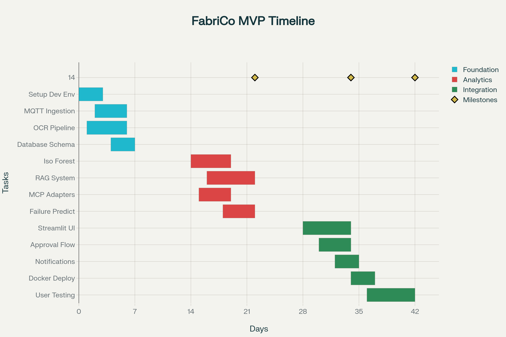

# Minimum Viable Product (MVP)

### MVP Goal

To demonstrate the core value loop of the proposed solution: successfully predict a single, high-impact failure mode for **one type of critical machine**, enrich the prediction with historical context, and present a clear, actionable alert to a maintenance team.

This MVP will prove that we can connect probabilistic AI insights to deterministic, operational actions.

-----

### Scope and Functionality

The MVP will focus on a narrow but complete vertical slice of the full solution.

Proposed MVP Architecture would look like below:



  * **Data Scope:**

      * **Machines:** Focus on **one specific machine type** (e.g., "CNC Press Model X") identified with FabriCo as being both critical and data-rich.
      * **Sensor Data:** Use a **historical batch export** (e.g., 6-12 months) of sensor data for that machine type. Real-time streaming is not included in the MVP.
      * **Maintenance Records:** A curated set of **50-100 historical maintenance PDFs** related specifically to the chosen machine type will be used to train the RAG system.
      * **Inventory:** A **CSV export** of the spare parts related to the target machine and their current inventory levels. Direct database integration is deferred.

  * **Core Functionality:**

    1.  **Failure Prediction:** A simple predictive model trained on the historical sensor data to predict **one specific failure mode** (e.g., "bearing overheat").
    2.  **Contextual Insight (RAG):** When a failure is predicted, the system will automatically retrieve the top 2-3 most relevant snippets from the historical maintenance PDFs.
    3.  **Structured Alert (MCP):** The prediction and context will be packaged into a simplified **Model Context Protocol (MCP)** JSON object. This demonstrates how we structure AI outputs.
    4.  **Demo Dashboard:** A simple web interface that displays alerts. When an alert is triggered, it will show the machine ID, the predicted failure, the retrieved historical notes, and the current stock level of the required part.

-----

### Technology Stack

The stack will prioritize speed of development for the demo.


  * **Prediction Model:** A standard machine learning model like **Random Forest** or a simple **LSTM** built with Scikit-learn or TensorFlow/PyTorch.
  * **RAG System:** A local **vector database** (e.g., ChromaDB) and a foundational **embedding model**.
  * **Dashboard/UI:** A simple web application built with a framework like **Streamlit** or **Gradio**, which is ideal for quickly building data-centric apps.
  * **Backend:** A lightweight Python backend (e.g., using **FastAPI**) to serve the model and RAG results.

-----
### Implementation Roadmap


### Demo Flow

The demo for FabriCo stakeholders would follow these steps:

1.  **Introduce the Scenario:** "We are looking at historical data for your CNC Press Model X. The system is monitoring for signs of bearing failure."
2.  **Show the Dashboard:** Display the clean, simple dashboard in its "all clear" state.
3.  **Simulate a Prediction:** Manually trigger an event using a specific timestamp from the historical data known to precede a failure.
4.  **The "Aha\!" Moment:** An alert for a specific machine pops up on the dashboard. Click into the alert.
```
============================================================
 FabriCo Predictive Maintenance Dashboard
============================================================
STATUS: 🔴 1 NEW HIGH-PRIORITY ALERT

------------------------------------------------------------
🚨 ALERT: PREDICTED FAILURE
------------------------------------------------------------
* Machine ID:     M-7891 (CNC Press Model X)
* Location:       Factory 2, Line B
* Prediction:     Main Spindle Bearing Failure (Overheating)
* Confidence:     91%
* Est. Timeframe: Within the next 48-72 hours

--- ACTIONABLE INSIGHTS ---

[1] RELATED HISTORICAL REPAIRS (from Maintenance Logs):
    >> Log #2024-034: "Technician: Evans. Bearing was glowing red hot on inspection.
       Replaced main spindle bearing. Took unit offline for emergency maint.
       Similar readings on sensor pack 3A for a week prior."

    >> Log #2023-512: "Technician: Miller. Customer reported high-pitched squeal.
       Found bearing had seized completely. Replaced P/N FBC-PART-4567.
       Note: Vibration sensors showed high-frequency anomaly for 3 days."

[2] REQUIRED PARTS CHECK (from Inventory CSV):
    >> Part SKU: FBC-PART-4567 (Spindle Bearing Assembly)
    >> Quantity Needed: 1
    >> In Stock: ✅ 4

[3] SUGGESTED ACTION:
    >> Schedule proactive maintenance for M-7891 within 48 hours to
       replace the main spindle bearing and avoid emergency downtime.
```
5.  **Explain the Actionable Insight:** Walk through the alert details:
      * "Here, the system predicts a **bearing failure is likely within the next 72 hours**."
      * "It has automatically pulled these **two past repair reports** for similar failures, noting the tools and time required." (Show RAG output).
      * "It also cross-referenced your inventory and confirms you have the **necessary replacement bearing in stock**." (Show inventory data).
      * "Finally, here is the structured **MCP** that the AI generated. This is what would programmatically kick off a workflow to create a maintenance ticket and notify your team." (Show the JSON).
6. **The "Under the Hood" Model Context Protocol (MCP)**
      * This is the key to our integration strategy. 
      * When the model generated the alert above, it didn't just send an email.
      * It created this structured JSON object.
      * This MCP is what allows us to programmatically interact with other systems (like ticketing or inventory) in the full version.
```JSON
{
  "event_id": "evt-20250312-a84b",
  "event_timestamp": "2025-03-12T11:21:00Z",
  "source_model": "BearingFailure_v1",
  "machine_id": "M-7891",
  "prediction": {
    "failure_mode": "bearing_overheating_seizure",
    "confidence_score": 0.91,
    "time_to_failure_hours": 48
  },
  "context": {
    "retrieved_logs": [
      "Log #2024-034",
      "Log #2023-512"
    ]
  },
  "recommended_action": {
    "type": "SCHEDULE_PROACTIVE_MAINTENANCE",
    "required_parts": [
      {
        "sku": "FBC-PART-4567",
        "name": "Spindle Bearing Assembly",
        "quantity": 1,
        "inventory_status": "IN_STOCK"
      }
    ],
    "urgency": "HIGH"
  }
}
```

